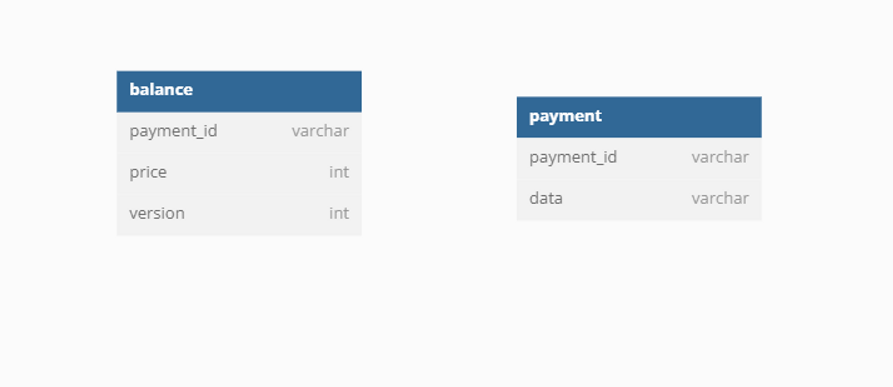

# :credit_card:결제시스템 

> 결제요청을 받아 카드사와 통신하는 인터페이스를 제공하는 결제시스템


## :hammer_and_wrench: 개발도구

|Category|Stack|
|:-|:-|
|Framework|`Spring Boot`|
|Language|`Java`|
| DB | `H2` |
| ORM | `Spring Data JPA` |


## :memo: Table




## :bulb: 문제해결 전략

### 기본키 생성 전략

- 종류
  - 애플리케이션에서 채번
    - db에 id가 이미 존재하는 지 확인하기 위해 SELECT 쿼리로 확인 후 INSERT를 하는 merge 방식으로 동작한다.
  - IDENTITY
    - insert 쿼리가 동작하면 database 시스템에서 자동으로 채번을 한다.
    - persist 시점에 즉시 쿼리를 실행해야 id값을 알 수 있으므로 쓰기 지연의 이점을 누릴 수 없다.
    - MySQL, PostgreSQL 등에서 지원한다.
  - SEQUENCE
    - 동작방식
      - persist를 호출하면 db요청 없이 시퀀스를 조회할 수 있다. (by JPA intialValue, allocationSize)
      - 가져온 시퀀스를 id에 할당하고, 트랜잭션이 commit될 때 insert 쿼리를 날린다.
- 선택 방안
  - SEQUENCE를 커스텀하는 방식을 사용하였다.
    1. 애플리케이션에서 날짜 ‘YYYYMMDD’ + SEQUENCE 형식의 길이 20의 String id 생성


### Multi Thread 환경 대비

- 하나의 카드번호로 동시에 결제할 수 없다.

  1. 하나의 카드번호로 동시에 결제요청이 들어오는 경우, 다른 결제번호가 부여되면서 둘 다 요청을 성공하게 두면 안된다.
     1. CardLock 테이블을 만들어서 결제시마다 version 확인하기.
        1. 카드정보가 CardLock 테이블에 있는지 확인한다.
        2. 있으면 해당 카드정보를 가져와서 update, 없으면 CardLock 객체를 새로 생성해서 save한다.

- 결제 한 건에 대한 전체 및 부분취소를 동시에 할 수 없다.

  1. 비관적 락

     1. `@Transactional` + `@Lock(LockModeType.PESSIMISTIC_WRITE)`
     2. 동시 요청에 대해서도 하나씩 처리가 가능하다

     ```java
     // service
     @Transactional(isolation = Isolation.READ_COMMITTED)
     public ResponseEntity<PaymentCancelDto.Response> savePaymentCancel(PaymentCancelDto.Request paymentCancelReq) throws Exception {
         // 결제 정보 가져오기
         String paymentId = paymentCancelReq.getPaymentId();
         Payment encryptedPayment = paymentRepository.findByPaymentId(paymentId).orElseThrow();
         ...
     ```
     
     ```java
     @Repository
     public interface PaymentRepository extends JpaRepository<Payment, String> {
     
         @Lock(LockModeType.PESSIMISTIC_WRITE)
         Optional<Payment> findByPaymentId(String paymentId);
     }
     ```
     
  2. 낙관적 락
  
     - `@Version`을 사용해 `Optimistic Lock` 적용
       - row update를 할 수 있는 형식의 테이블이 필요함 (Balance) 
     
     - 동시 요청에 대해서 하나를 제외한 나머지 요청은 무시된다.
     
  3. 비관적 락 vs 낙관적 락

     - **비관적 락**은 충돌이 날 것이라고 가정하고 db에서 해당 ROW에 잠금을 거는 방식이고, **낙관적 락**은 충돌이 나지 않을 것이라고 가정하고 어플리케이션 레벨에서 version 칼럼의 변화를 감지하는 방식이다.
     
     - 동시적인 요청을 허용하지 않고 튕겨내야 하는 경우에는 **낙관적 락**을 사용한다. 반대로 동시적인 요청을 하나씩 처리해야 하는 상황에서는 **비관적 락**을 고려해볼 수 있다.
     
     - 명세서에 동시 요청이 불가능하다는 제약 조건이 명시되어있으므로 **낙관적 락**을 선택하였다.


## :pencil2:배운 내용

- Entity vs Dto
- requestDto responseDto 한번에 관리하기
- Spring Data JPA
  - JPA allocationSize default 값이 50인 이유
    - allcationSize 만큼 db에서 한번에 시퀀스 값을 증가시키고 메모리에 시퀀스 값을 할당하는 방식으로 동작한다.
    - 시퀀스를 50개씩 메모리에 할당할 수 있어 멀티스레드 환경에서도 각 서버마다 받는 시퀀스 셋을 다르게 하여 기본키 충돌을 막을 수 있다.
    - 중간에 서버가 내려가면 기존 메모리에 있던 시퀀스는 날라가게 된다.
- primary key 생성 전략
- 암/복호화 방식
- 단위테스트
- Optional
- JPA Locking 방법
  - Optimistic Lock
    - 동일한 데이터에 대한 여러 업데이트가 서로 간섭하지 않도록 `version`이라는 속성을 확인하여 Entity의 변경사항을 감지하는 메커니즘
    - JPA에서 낙관적 잠금을 사용하기 위해서는 Entity 내부에 `@Version` Annotation이 붙은 Int, Long Type의 변수를 구현하여줌으로써 간단하게 구현이 가능하다.
    - 트랜잭션 동안 update 대상의 version값이 영속객체의 version값과 다르다면 Exception을 발생시킨다.
  - Pessimistic Lock
    - 트랜잭션의 충돌이 발생한다고 가정하고 우선 락을 걸고 보는 방법
    - 트랜잭션안에서 서비스로직이 진행되어야 한다.

- Transaction 격리 수준
  1. uncommitted read
  2. committed read
  3. repeatable read
  4. serializable
